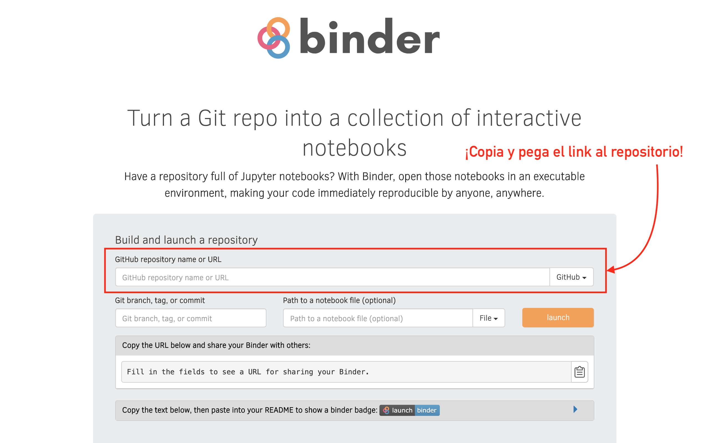

# open-data 📊

Taller introductorio a manipulación y visualización de datos abiertos.

## Setup

Ve a <https://mybinder.org> y en el campo **GitHub repository name or URL** copia y pega el siguiente link: 

> #### <https://github.com/RodolfoFerro/open-data>

¡Da clik en el botón **launch** y listo!

Si te resulta más sencillo, puedes pulsar el siguiente botón: 

## Visualizaciones

A continuación puedes ver algunas de las visualizaciones generadas:

### Puntos de conectividad en la ciudad 1 – OpenStreetMap
<iframe width="100%" height="500" src="OpenStreetMap_puntos.html" frameborder="0" allowfullscreen></iframe>
   

### Puntos de conectividad en la ciudad 2 – Watercolor
<iframe width="100%" height="500" src="Stame_Watercolor_puntos.html" frameborder="0" allowfullscreen></iframe>
   

### Población atendida por punto de conectividad 1 – Toner
<iframe width="100%" height="500" src="Stamen_Toner_puntos.html" frameborder="0" allowfullscreen></iframe>
   

### Población atendida por punto de conectividad 2 – Dark Matter
<iframe width="100%" height="500" src="CartoDB_dark_matter_puntos.html" frameborder="0" allowfullscreen></iframe>
   

### Población atendida por punto de conectividad 2 – Positron
<iframe width="100%" height="500" src="CardtoDB_positron_puntos.html" frameborder="0" allowfullscreen></iframe>
   